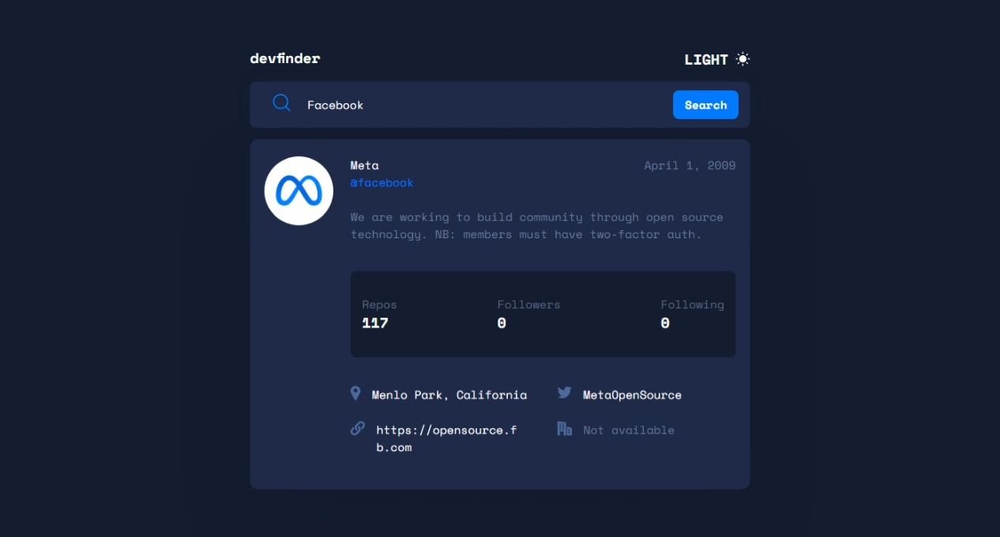

<h1 align="center">
    GitHub-user Search App
</h1>
<h3>
    A search app to find GitHub users built with React, and Tailwindcss.
</h3>
<p>
    This app is based on the Frontend Mentor Challenge <a href="https://www.frontendmentor.io/challenges/github-user-search-app-Q09YOgaH6">GitHub user search app</a>, and was built with Parcel v2.4.1, React v18.0.0 and tailwindcss v3.0.24, using the GitHub Users API <a href="https://api.github.com/users/">GitHub Users</a>. 
</p>
<p>Site is deployed at <a href="https://ichiklaus-github-user-search.netlify.app/">GitHub-user search app</a> </p>



---

## Setup

1.  Install dependencies:

```sh
npm install
```

2.  Run dev server:

```sh
npm start
```
